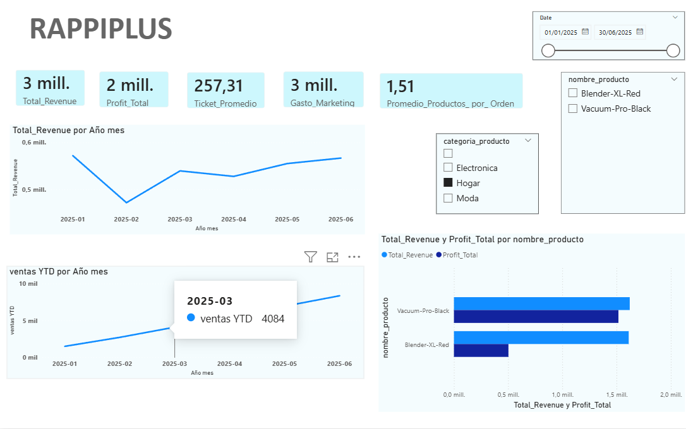
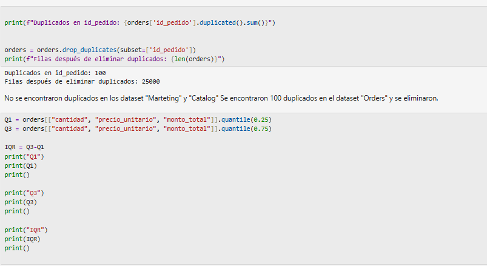
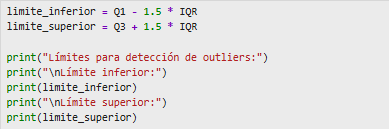
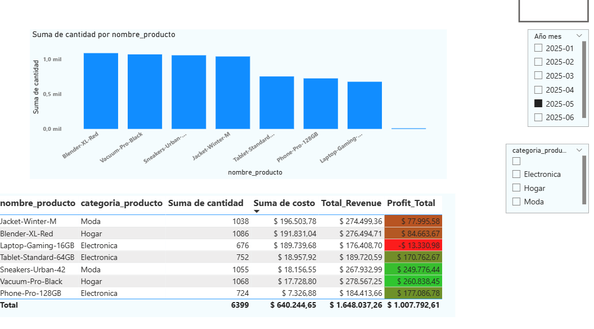
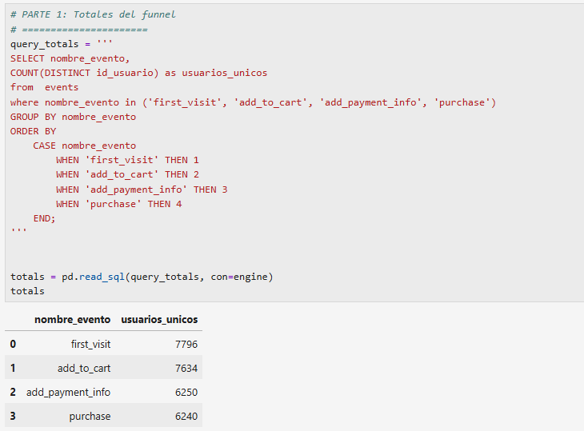
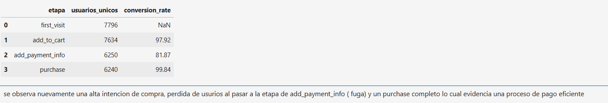
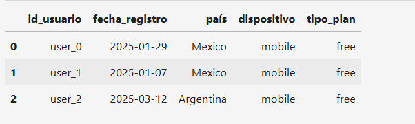
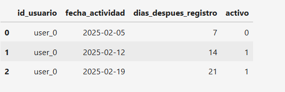
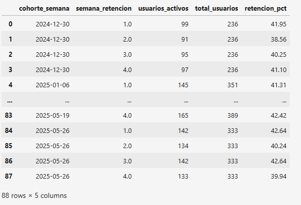
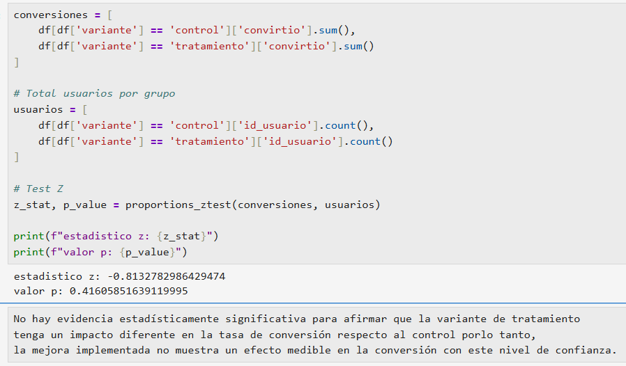

 # RappiPlus: De datos a decisiones de negocio

📊 RappiPlus: De datos a decisiones de negocio

## PROBLEMA Y PREGUNTAS CLAVE

RappiPlus buscaba aumentar la frecuencia de compra y el valor generado por usuario mediante un modelo de suscripción. Sin embargo, el equipo de negocio no tenía claridad sobre su desempeño.

🎯 El reto consistía en responder preguntas clave:

-¿Los usuarios compran más después de suscribirse?
-¿El servicio es rentable?
-¿Dónde abandonan el proceso de compra?
-¿Los usuarios regresan a la plataforma?
-¿Los cambios implementados en el producto generan impacto?

## METODOLOGIA

Desarrollé un análisis integral utilizando Python, SQL y Power BI para evaluar el desempeño del servicio desde diferentes perspectivas.

-Calidad y preparación de datos
-Limpieza y validación de tres fuentes de información.
-Tratamiento de inconsistencias y valores faltantes.
-Construcción de datasets listos para análisis.

### 🔍Análisis de rentabilidad
-Cálculo de Revenue, Cost y Profit.
-Identificación de categorías y segmentos más rentables.
-Evaluación de la contribución de cada línea de negocio.
 

 
### Funnel de conversión
-Análisis del recorrido de los usuarios desde la primera visita hasta la compra.
-Identificación de los puntos con mayor abandono.
-Detección de oportunidades de optimización del proceso de compra.

### Retención de usuarios
-Construcción de cohortes de usuarios.
-Medición del comportamiento de retorno en el tiempo.
-Identificación de patrones de abandono y fidelización.

       

### Evaluación de impacto
-Análisis de un experimento A/B.
-Comparación entre grupo control y tratamiento.
-Validación estadística de resultados para apoyar la toma de decisiones.

### Dashboard ejecutivo
-Diseño de un dashboard interactivo en Power BI.
-Consolidación de KPIs financieros, conversión y retención.
-Comunicación de insights para stakeholders de negocio.

## 📈RESULTADOS PARA EL NEGOCIO

El análisis permitió evaluar de manera integral el desempeño de RappiPlus, identificando oportunidades de mejora en conversión, retención y rentabilidad.

**Entre los principales hallazgos:**
● Se evidenció una buena rentabilidad del negocio.
● Las cohortes muestran una retención relativamente estable entre las semanas 1 y 4 y durante 2025 se observa un crecimiento importante en el tamaño de las cohortes, indicando una mayor adquisición de usuarios manteniendo niveles consistentes de engagement.
● Se identificaron que el punto de mayor abandono dentro del funnel de compra es add_payment_info.
● Se determinaron los segmentos con mayor contribución a la rentabilidad.
● Se evaluó el impacto real de cambios implementados mediante experimentación A/B, el cual arrojo como resultado que no hay evidencia estadísticamente significativa para afirmar que la variante de tratamiento tenga un impacto diferente en la tasa de conversión respecto al control.
● Se consolidó la información en un dashboard que facilita la toma de decisiones basada en datos.

## 🛠️HERRAMIENTAS UTILIZADAS

● Python (Pandas, proportions_ztest)
● SQL
● Power BI
● Jupyter Notebook
● Análisis de cohortes
● A/B Testing

